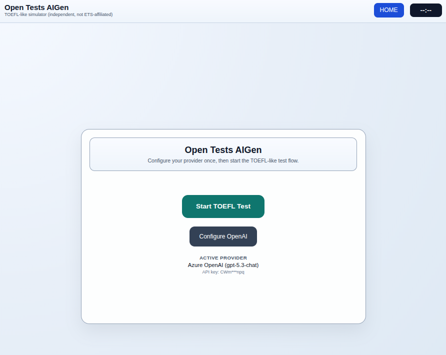

# Open Tests AIGen

TOEFL-like 2026 simulator with:
- React frontend (Vite)
- NestJS + GraphQL backend
- PostgreSQL persistence (Prisma)
- Redis/worker process scaffold
- OpenAI-compatible generation and analysis pipeline

## What is implemented now

1. Docker Compose orchestration for frontend/api/worker/postgres/redis.
2. Backend GraphQL flows for:
   - provider config save/test
   - session start/query/complete
   - next task generation
   - answer save
   - report generation
3. Generation pipeline for READING/LISTENING/SPEAKING/WRITING task payloads.
4. OpenAI-compatible `/responses` endpoint integration across:
   - text generation (`GenerationService`)
   - report insights + B2/C1 examples (`ReportService`)
   - speaking transcript evaluation (`SpeechAnalysisService`)
5. Model-aware reasoning effort fallback:
   - prefers `minimal` for generation and `high` for analysis
   - auto-falls back to `medium` on models that only support `medium` (for example `gpt-5.3-chat-*`).
6. Listening support for audio generation + chunk playback (including conversation handling).
7. Frontend runner improvements:
   - per-question speaking timer flow
   - real-time word counter for writing responses
   - multiline rendering fixes for prompts, transcripts, analysis, and B2/C1 examples.
8. Architecture/docs package under `docs/`.

## Current status

Functional local end-to-end stack for iterative development/testing.

Known limitations:
- No auth/multi-tenant user model yet.
- Scoring/evaluation is simulator-oriented and not official TOEFL scoring.
- Worker process exists, but background workloads are still limited.
- PDF export/report packaging is not fully implemented.
- Some TOEFL 2026 details remain under review in `docs/toefl-2026-open-questions.md`.

## Run locally

1. Copy env file:
   - `cp .env.example .env`
2. Start stack:
   - `docker compose up --build`
3. Open:
   - Frontend: `http://localhost:5173`
   - GraphQL API: `http://localhost:4000/graphql`
   - Health: `http://localhost:4000/health`

## Key paths

- `docker-compose.yml`
- `backend/prisma/schema.prisma`
- `backend/src/graphql/session.resolver.ts`
- `backend/src/services/generation.service.ts`
- `backend/src/services/report.service.ts`
- `backend/src/services/speech-analysis.service.ts`
- `frontend/src/App.tsx`
- `docs/architecture.md`

## Next implementation steps

1. Harden runtime validation/tests across generation + report flows.
2. Expand job queue/background processing for heavy analysis tasks.
3. Implement report export (PDF) and persistence polish.
4. Continue TOEFL 2026 blueprint alignment as official details solidify.
